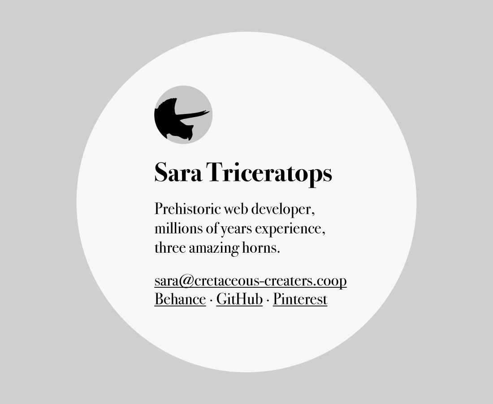

# Coming soon page

## Overview

- Should contain the following information: your name, a brief bio, email address, social media links, photo or icon.
- Make sure the website is flexible 320px – ~2500px.
- **We’ll be putting it live—on your domain—next week.**

---

## Goal

The included wireframe is an example of what you might do on large screen websites. *It’s up to you to design it for all screen sizes.*

**Obviously you should make it your own thing with your own style and brand.**

---

## Hand in

Show the teacher that it’s a live website—on your domain—at the end of next class.
